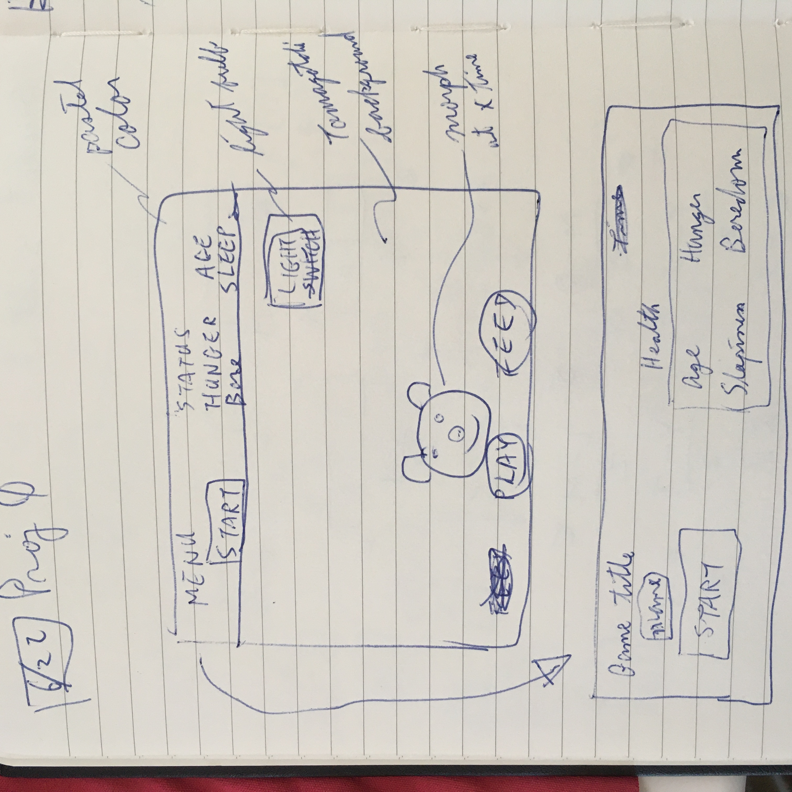

# Tamagotchi-Game
Tamagotchi online game

Scope:

Objective of the project is to build a Tamagotchi like online game. Part of the project goals is to leverage new knowledge learned and independently research ways to solve problems encountered.

------------------------
User Stories:

Tamagotchi 🐼 is your pet.  It is just like a real pet.  It ages over time.  It needs to sleep.  And you need to make sure it is fed and entertained or else it could die.  Then THAT would be sad 🥺.

Game goal:
1) Keep Tamagotchi alive.
    + By feeding it (keep your eyes on the hunger level)
    + By playing with it so it doesn't die from boredom (keep your eyes on the boredom level)
    + Make sure it has enough sleep (keep your eyes on the sleepiness level) 
2) Watch it ages over time.

How to play:
1) Click "New Pet" to start the game
2) Click "Feed" to feed your pet; hunger level scales from 1 to 10 (1 = full, 10 = starving)
3) Click "Play" to play with your pet; boredom level scales from 1 to 10 (1 = well entertained, 10 = bored to death)
4) Turn the light off for it to sleep; sleepiness level scales from 1 to 10 (1 = well rested, 10 = extremely sleepy)
5) Each new pet starts at age 1 and with level 5 of sleepiness, hunger, and boredom.
6) Check back once in a while to make sure it is not hungry or bored
7) Your pet cannot play or eat while it is sleeping
8) When it is very full or very hungry, playing will not reduce boredom as fast
9) Your pet will not be bored when it sleeps but it could still feel hunger
10) Your pet will morph after a certain age
11) if it is happy (meaning not too full, not too hungry, or not too sleepy), it will jump around on the screen

------------------------
Approach:

1) build static html and simple CSS
2) arrange the page to the general desired look
3) create functionality of the game in js
4) create game interaction link to JS
5) animate and improve game good and feel
6) after minimum viable product is completed, start adding new game features
7) responsive design

Challenges:
+ input, start and light bulb buttons are inaccessible for a certain size of window; need to investigate the cause and/or find an alternative solution

------------------------
Wireframes:

------------------------
Technology used:

Frontend: HTML, CSS, JS, jQuery
